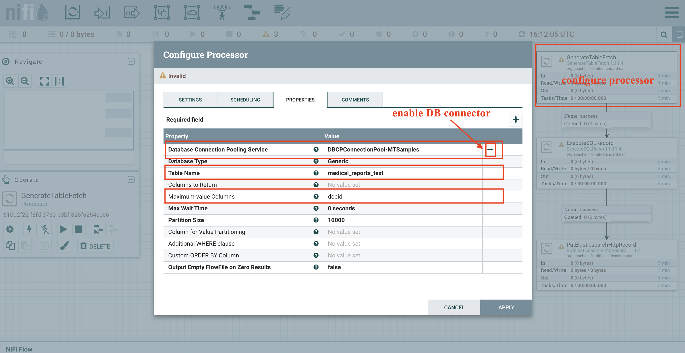
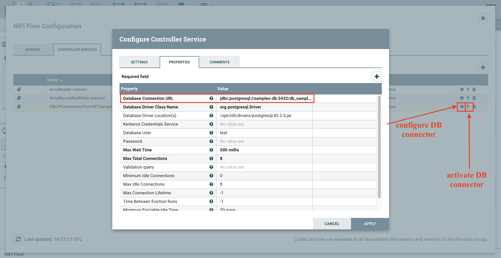

# Introduction
Our custom Apache NiFi image comes with 4 example template workflows bundled that available in [user templates](../nifi/user-templates) in `../nifi` directory.
These are:
1. `Ingest raw text from DB to ES` - performing ingestion of free-text notes from database to Elasticsearch.
2. `Ingest PDFs from DB to ES` - performing ingestion of raw notes in PDF format from database to Elasticsearch.
3. `MedCAT annotate from DB to ES` - annotating the free-text notes using MedCAT, reading from database and storing in Elasticsearch.
4. `MedCAT annotate from DB to ES` - the same as (3) but reading notes from Elasticsearch.


# Used services
In the workflow examples, the following services are used:
- `samples-db` - storing the example input data,
- `nifi` - the actual Apache NiFi data pipeline engine with user interface,
- `elasticsearch-1` - for storing the resulting documents data,
- `tika-service` - extraction of text from binary documents,
- `nlp-medcat-medmen` - an example NLP application for extracting annotations from free-text.

To deploy the above services, one can type: 
```
make start-data-infra
make start-nlp-medcat
```

Please note that all the above services will be accessible by services within internal `cognet` Docker network while only some of them will be accessible from host machine.
Please refer to [SERVICES.md](./SERVICES.md) for a more detailed description of the available services and their deployment.


# Apache NiFi web user interface
Before start, please see [the official Apache NiFi guide on using the web user interface](https://nifi.apache.org/docs/nifi-docs/html/user-guide.html#User_Interface) that covers extensively the available functionality.

In this README, only the key aspects will be covered on using the bundled user templates with configuring and executing the flows.

Once deployed, Apache NiFi web interface will be accessible from the host (e.g. localhost) machine at `http://localhost:8080`.

To see all available user workflow templates navigate to **Templates** window by clicking the corresponding list item as presented on the figure below.
Following, to select an example workflow template to run, drag and drop the **template** button from the components toolbar panel to the main notepad window.


# Ingesting free-text documents
This workflow implements a common data ingestion pipeline: reading from a database and storing the free-text data alongside selected structured fields into Elasticsearch.
The workflow was presented on the figure above.


Free-text data alongside available structured fields are read from `samples-db` database from `medical_reports_text` table. 
This operation in handled by NiFi components: `GenerateTableFetch` and `ExecuteSQLRecord`,  where the configuration of the former component is described on the picture below.
`docid` is st as the primary key of the `medical_reports_text` table and is used persist the state of the last read record and to partition the records while reading.


However, apart from specifying the DB tables, the DB connector needs to configured and activated.
Alongside the DB connector, other controllers used by the processors need to be activated too - this is presented on the picture below.


The records are finally stored in Elasticsearch data store under index `medical_reports_text` and using url endpoint `http://elasticsearch-1:9200`.


## Ingesting raw text
TODO

## Ingesting extracted text from PDFs
TODO

# Annotating free-text documents
TODO

Required services:
- data infrastructure
- medcat
