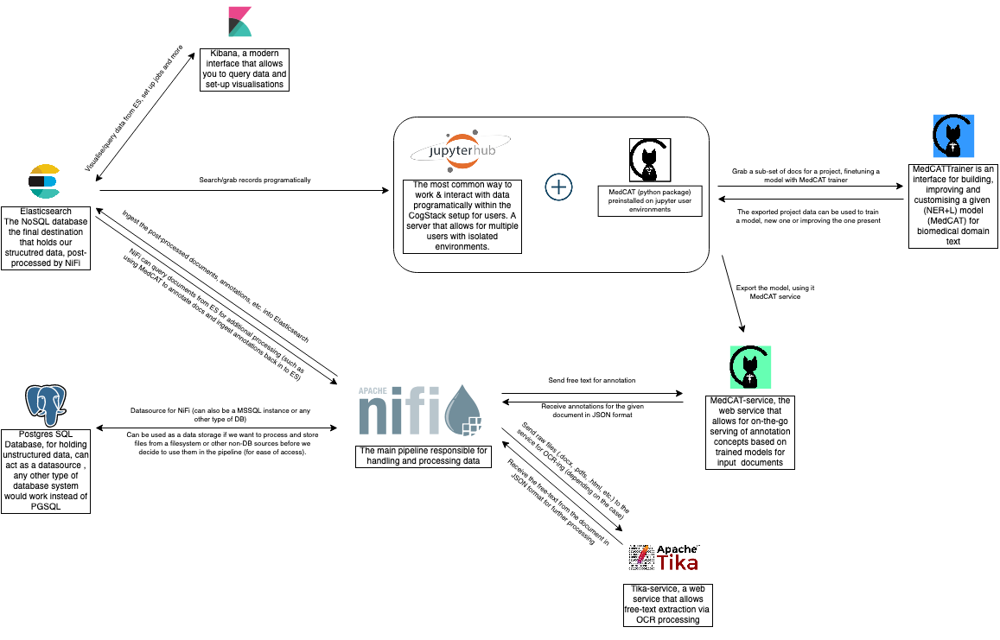

# Available Services
This file covers the available services in the example deployment.

Apache NiFi-related files are provided in [`../nifi`](../nifi) directory.
 
Please note that all the services are deployed using [Docker](https://docker.io) engine and it needs to be present in the system.

## Overview

The below image sums up how CogStack services work with eachother in an environment where all available components are used.



## Primary services
All the services are defined in `services.yml` file and these are:
- `samples-db` - a PostgreSQL database with sample data to play with,
- `cogstack-databank-db` - production PostgreSQL database, has it's own scripts in `/services/cogstack-db/pgsql`
- `cogstack-databank-db-mssql` - production MSSQL database, has it's own scripts in `/services/cogstack-db/mssql`, this is just an alternative, needs a license.
- `nifi` - a single instance of Apache NiFi processor (with Zookeper embedded) with exposing a web user interface,
- `nifi-nginx` - used for reverse proxy to enable secure access to NiFi and other services.
- `tika-service` - the [Apache Tika](https://tika.apache.org/) running as a web service (see: [Tika Service repository](https://github.com/CogStack/tika-service/)).
- `nlp-gate-drugapp` - an example drug names extraction NLP application using [GATE NLP Service runner exposing a REST API](https://github.com/CogStack/gate-nlp-service),
- `nlp-medcat-medmen` - [MedCAT](https://github.com/CogStack/MedCAT) NLP application running as a [web Service](https://github.com/CogStack/MedCATservice) and using an example model trained on [Med-Mentions](https://github.com/chanzuckerberg/MedMentions) corpus,
- `medcat-trainer-ui` - [MedCAT Trainer](https://github.com/CogStack/MedCATtrainer) web application used for training and refining MedCAT NLP models,
- `medcat-trainer-nginx` - a [NGINX](https://www.nginx.com/) reverse-proxy for MedCAT Trainer,
- `elasticsearch-1/elasticsearch-2` - a two-node cluster of Elasticsearch based on [OpenSearch for Elasticsearch](https://opensearch.org/) distribution, 
- `kibana` - Kibana user-interface based on [OpenSearch for Elasticsearch](https://opensearch.org/docs/latest/dashboards/index/) distribution,
- `jupyter-hub` - a single instance of [Jupyter Hub](https://jupyter.org/hub) for serving Jupyter Notebooks for interacting with the data.

## Optional NLP services
In addition, there are defined such NLP services:
- `nlp-medcat-snomed` - same as `nlp-medcat-medmen` but serving a SNOMED CT model,
- `nlp-gate-bioyodie` - same as `nlp-gate-drugapp` but serving [Bio-YODIE](https://github.com/GateNLP/Bio-YODIE) NLP application.

These services are optional and won't be started by default.
They were left in the `services.yml` file for informative purposes if one would be interested in deploying these having access to necessary resources.


**Important**
Please note that `nlp-medcat-snomed` and `nlp-gate-bioyodie` NLP services use license-restricted resources and these need to be provided by the user prior running these services.
Bio-YODIE requires [UMLS](https://www.nlm.nih.gov/research/umls/index.html) resources that need to be provided in the `RES_BIOYODIE_UMLS_PATH` directory.
MedCAT SNOMED CT model requires a prepared model based on [SNOMED CT](http://www.snomed.org/) dictionary with the model available in `RES_MEDCAT_SNOMED_PATH` directory.
These paths can be defined in `.env` file in the deployment directory.

For more information on available services resources, please see [README](../services/README.md) in `services` directory.


## Security
**Important**
Please note that for the demonstration purposes, the services are run with default built-in usernames / passwords.
Moreover, SSL encryption is also disabled or not set up in the configuration files.
For more information please see the [security](../security.md)

## Deployment
The example deployment recipes are defined in `Makefile` file.
The commands that start services are prefixed with `start-` keyword, similarly the ones to stop are prefixed with `stop`.

## Data ingestion and storage infrastructure
To deploy the data ingestion and storage infrastructure, type:
```
make start-data-infra
```
The command will deploy services: `nifi`, `elasticsearch-1`, `kibana`, `tika-service`, `samples-db`.
Please see below the description of the services with the information on the accessibility.

To stop the services, type:
```
make stop-data-infra
```

## NLP services

### GATE
To deploy an example GATE NLP Drug names extraction application as a service, type:
```
make start-nlp-gate
```
The command will deploy `nlp-gate-drugapp` service.
Please see below the description of the deployed NLP service.

To stop the service, type:
```
make stop-nlp-gate
```

### MedCAT
To deploy MedCAT application stack, type:
```
make start-nlp-medcat
```
The command will deploy MedCAT NLP service `nlp-medcat-medmen` with related MedCAT Trainer services `medcat-trainer-ui`, `medcat-trainer-nginx`.
Please see below the description of the deployed NLP services.

To stop the services, type:
```
make stop-nlp-medcat
```

## Jupyter Hub
To deploy Jupyter Hub, type:
```
make start-jupyter
```
Please see below the description of the Jupyter Hub.

To stop the services, type:
```
make stop-jupyter
```

## Cleanup
To tear down all the containers and the data persisted in mounted volumes, type:
```
make cleanup
```

## Services description
All the essential details on the services configuration are defined in `services.yml` file.

Please note that all the services are running within a private `cognet` Docker network hence the endpoints are all accessible within the deployed services.
However, for the ease of use, some of the services have their ports bound from container to the host machine.


## Samples DB
`samples-db` provides a [PostgreSQL](https://www.postgresql.org/) database that contains sample data to play with. 
During start-up the data is loaded from a previously generated DB dump.

When deployed the PostgreSQL database is exposed at port `5432` of the `samples-db` container.
The port is also bound from container to the host machine `5555` port.
The example data is stored in `db_samples` database. 
Use user `test` with password `test` to connect to it.

The free-text sample data is based on [MT Samples](https://www.mtsamples.com/) dataset with the structured fields generated by [Synthea](https://github.com/synthetichealth/synthea).
The tables available in the database are:
- `patients` -  structured patient information,
- `encounters` - structured encounters information,
- `observations` - structured observations information,
- `medical_reports_raw` - free-text documents in raw format (PDFs) `(*)`,
- `medical_reports_text` - free-text documents in clean, text format `(*)`,
- `medical_reports_processed` - for storing processed documents, empty `(*)`,
- `annotations_medcat` - for storing extracted MedCAT annotations, empty.

The tables used in the deployment example are marked with `(*)`.

## Cogstack-db
This is a general database provided for production, it does not have any data in it beyond the defined cogstack_schema (this is not yet present) and annotation_schema.
Provided for both PGSQL and MSSQL.

In the future the `${DB_PROVIDER}` will be an environment variable that will take into account the db-provider you can select, possible values [`mssql`,`pgsql`]

By default all the `.sql` files beginning with `annotations*` and `cogstack*` prefix in the `services/cogstack-db/${DB_PROVIDER}/schemas/` will be loaded. This is defined in the `services/cogstack-db/${DB_PROVIDER}/init_db.sh`. There should not be a need to change them as users can simply name their schemas accordingly. Place the desired `sql` files in the `schemas` folder and it will be picked up. To debug any issues with the container or with the SQL scripts please run the startup commands separately `docker-compose -f services.yml up cogstack-databank-db` or `docker-compose -f services.yml cogstack-databank-db-mssql` while in the `deploy/` folder.

### MSSQL note
The MSSQL container will require license activation for production as per [Microsoft's guideline](https://hub.docker.com/_/microsoft-mssql-server), setting the `MSSQL_PID` env variable to the correct license PID key should activate the product.

## Apache NiFi
`nifi` serves a single-node instance of Apache NiFi that includes the data processing engine with user interface for defining data flows and monitoring.
Since this is a single-node NiFi instance, it also contains the default, embedded [Apache Zookeper](https://zookeeper.apache.org/) instance for managing state.

`nifi` container exposes port `8443` which is also bound to the host machine on port 8082.
<br>

`nifi-nginx` contianer exposes the 8443 port directly, reverser-proxying the connection to nifi.
The Apache NiFi user interface can be hence accessed by navigating on the host (e.g. `localhost`) machine at `http://localhost:8443`.

In this deployment example, we use a custom build Apache NiFi image with example user scripts and workflow templates.
For more information on configuration, user scripts and user templates that are embeded with the custom Apache NiFi image please refer to the [nifi](../nifi.md).
The available example workflows are covered in [workflows](./workflows.md)
Alternatively, please refer to [the official Apache NiFi documentation](https://nifi.apache.org/) for more details on actual use of Apache NiFi.

## Tika Service
`tika-service` provides document text extraction functionality of [Apache Tika](https://tika.apache.org/).
[Tika Service](https://github.com/CogStack/tika-service) implements the actual Apache Tika functionality behind a RESTful API.

When deployed Tika Service exposes port `8090` at `tika-service` container being available to all services within `cognet` Docker network, most importantly by `nifi` data processing engine.
The Tika service REST API endpoint for processing documents is available at `http://tika-service:8090/api/process`.

For more details on configuration, API definition and example use of Tika Service please refer to [the official documentation](https://github.com/CogStack/tika-service).

## NLP Services

### NLP API
All the NLP services implement a RESTful API that is defined in [OpenAPI specification](https://github.com/CogStack/CogStack-Nifi/services/nlp-services/api-specs/openapi.yaml).

The available endpoints are:
- **GET** `/api/info` - for displaying general information about the used NLP application,
- **POST** `/api/process` - for processing text documents (single document mode),
- **POST** `/api/process_bulk` - for processing multiple text documents (bulk mode).

When plugging-in the NLP services into Apache NiFi workflows, the endpoint for processing single or multiple documents will be used to extract the annotations from documents.
Please see example Apache NiFi [workflows](./workflows.md) and [user scripts](https://github.com/CogStack/Cogstack-Nifi/nifi/user-scripts) on using and parsing the payloads with NiFi.

For further details on the used API please refer to the [OpenAPI specification](https://github.com/CogStack/CogStack-Nifi/services/nlp-services/api-specs/openapi.yaml) for the definition of the request and response payload.

### GATE NLP
`nlp-gate-drugapp` serves a simple drug names extraction NLP application using [GATE NLP Service](https://github.com/CogStack/gate-nlp-service).
This simple application implements annotation of common drugs and medications. 
It was created using [GATE NLP](https://gate.ac.uk/sale/tao/splitch13.html) suite and uses GATE ANNIE Gazetteer plugin. 
The GATE application definition and resources are available in directory [`./services/nlp-services/applications/drug-app`](https://github.com/CogStack/CogStack-Nifi/services/nlp-services/applications/drug-app/).

When deployed `nlp-gate-drugapp` exposes port `8095` on the container.
The port is also bound from container to the host machine `8095` port.
The service endpoint should be available to all the services running inside the `cognet` Docker network.
For example, to access the API endpoint to process a document by a service in `cognet` network, the endpoint address would be `http://nlp-gate-drugapp:8095/api/process`.

As a side note, when deployed `nlp-gate-bioyodie` (assuming that the Bio-YODIE resources are properly set up with `RES_BIOYODIE_UMLS_PATH` variable), the service will only expose port `8095` on container.
Although the service won't be accessible from the host machine, but all the services inside the `cognet` network will be able to access it.

For more information on the GATE NLP Service configuration and use please refer to [the official documentation](https://github.com/CogStack/gate-nlp-service).


### MedCAT NLP
[MedCAT](https://github.com/CogStack/MedCAT) is a named entity recognition and linking application for concept annotation from UMLS or any other source.
MedCAT deployment consists of [MedCAT NLP Service](https://github.com/CogStack/MedCATservice) serving NLP models via RESTful API and [MedCAT Trainer](https://github.com/CogStack/MedCATtrainer) for collecting annotations and refinement of the NLP models.

### MedCAT Service
`nlp-medcat-medmen` serves a basic UMLS model trained on MedMentions dataset via RESTful API.
The served model data is available in [`./services/nlp-services/applications/medcat/models/medmen/`](https://github.com/CogStack/CogStack-Nifi/services/nlp-services/applications/medcat/models/medmen`) directory.

When deployed `nlp-medcat-medmen` exposes port `5000` on the container and binds it to port `5000` on the host machine.
For example, to access the API endpoint to process a document by a service from `cognet` Docker network, the endpoint address would be `http://nlp-medcat-medmen:5000/api/process`.

As a side note, when deployed `nlp-medcat-snomed` (assuming that the MedCAT SNOMED CT model is available and set via `RES_MEDCAT_SNOMED_PATH` variable), the service will only expose port `5000` on container.
Although the service won't be accessible from the host machine, but all the services inside the `cognet` network will be able to access it.

For more information on the MedCAT NLP Service configuration and use please refer to [the official documentation](https://github.com/CogStack/MedCATservice).


### MedCAT Trainer
`medcat-trainer-ui` serves the MedCAT Trainer web application used for training and refining MedCAT NLP models.
Such trained models can be later saved as files and loaded into MedCAT Service.
Alternatively, the models can be loaded into custom application.

As a companion service, `medcat-trainer-nginx` serves as a NGINX reverse-proxy for providing content from MedCAT Trainer web service.

When deployed, `medcat-trainer-ui` exposes port `8000` on the container.
`medcat-trainer-nginx` exposes port `8000` on the container and binds it to port `8001` on the host machine - it proxies all the requests to the MedCAT Trainer web service.

To access the MedCAT Trainer user interface and admin panel, one can use the default built-in credentials: user `admin` with password `admin`.

For more information on the MedCAT Trainer  configuration and use please refer to [the official documentation](https://github.com/CogStack/MedCATtrainer).


## ELK stack
The example deployment uses [ELK stack](https://www.elastic.co/what-is/elk-stack) from [OpenSearch for Elasticsearch](https://opensearch.org/) distribution.
OpenSearch for Elasticsearch is a fully open-source, free and community-driven fork of Elasticseach.
It implements many of the commercial X-Pack components functionality, such as advanced security module, alerting module or SQL support. 
Nonetheless, the standard core functionality and APIs of the official Elasticsearch and OpenSearch remain the same. 
Hence, OpenSearch can be used as a drop-in replacement for the standard ELK stack.

In the example deployment, the default built-in user credentials are used, such as user: `admin` with pass `admin`.


**Important**
Please note that for the demonstration purposes SSL encryption has been disabled in Elasticsearch and Kibana.
For enabling it and generating self-signed certificates please refer directly to the `services.yml` file and [README](../security/README.md) in `security` directory.
The security aspects are covered expensively in [the official OpenSearch for Elasticsearch documentation](https://opensearch.org/).


### Elasticsearch
Elasticsearch cluster is deployed as a single-node cluster with `elasticsearch-1` service.
It exposes port `9200` on the container and binds it to the same port on the host machine.
The service endpoint should be available to all the services running inside the `cognet` Docker network under address `http://elasticsearch-1:9200`.
The default user is : `admin` and password `admin`.
In the example deployment, the default, built-in configuration file is used with selected configuration options being overridden in `services.yml` file.
However, for manual tailoring the available configuration parameters are available in the `elasticsearch.yml` [configuration file](https://github.com/CogStack/CogStack-Nifi/services/elasticsearch/config/elasticsearch.yml).

For more information on use of Elasticsearch please refer either to [the official Elasticsearch documentation](https://www.elastic.co/guide/en/elasticsearch/reference/current/index.html) or [the official OpenSearch for Elasticsearch documentation](https://opensearch.org/).


### Kibana
`kibana` service implements the Kibana user interface for interacting with the data stored in Elasticsearch cluster. 
It exposes port `5601` on the container and binds it to the same port on the host machine.
To access Kibana user interface from web browser on the host (e.g. `localhost`) machine one can use URL: `https://localhost:5601`.
The default user is : `admin` and password `admin`.
In the example deployment, the default, built-in configuration file is used with selected configuration options being overridden in `services.yml` file.
However, for manual tailoring the available configuration parameters are available in `kibana.yml` [configuration file](https://github.com/CogStack/CogStack-Nifi/services/kibana/config/kibana.yml).

For more information on use of Kibana please refer either to [the official Kibana documentation](https://www.elastic.co/guide/en/kibana/current/index.html) or [the official OpenSearch for Elasticsearch documentation](https://opensearch.org/docs/latest/dashboards/index/).


## Jupyter Hub

`jupyter-hub` service provides a single instance of Jupyter Hub to serve Jupyter Notebooks containers to users. In essence, the jupyter-hub container will spawn jupyter-singleuser containers for users, on the fly, as necessary. The settings applied to the jupyter-hub service in `services.yml` won't apply to the singleuser containers, please note that the singleuser containers and jupyter-hub container are entirely independent of one another.

It exposes port `8888` on the container and binds to the same port on the host machine.
Since `jupyter-hub` is running in the `cognet` Docker network it has access to all services available within it, hence can be used to read data directly from Elasticsearch or query NLP services.

For more information on the use and configuration of Jupyter Hub please refer to [the official Jupyter Hub documentation](https://jupyter.org/hub).

### Access and account control
To access Jupyter Hub on the host machine (e.g. localhost), one can type in the browser `http://localhost:8888`.

Creating accounts for other users is possible, just go to the admin page `https://localhost:8888/hub/admin#/`, click on add users and follow the instructions (make sure usernames are lower-cased and DO NOT contain symbols, if usernames contain uppercase they will be converted to lower case in the creation process).

The default password is blank, you can set the password for the admin user the first time you LOG IN, remember it.

Or you can set the password is defined by a local variable `JUPYTERHUB_PASSWORD` in `.env` file that is the password SHA-1 value if the authenticator is set to either LocalAuthenticator or Native read more in [jupyter doc](https://jupyterhub.readthedocs.io/en/stable/api/auth.html?highlight#) about this. 

<strong><u>Users must use the "/work/"directory for their work, otherwise files might not get saved!</u></strong>

### User singleuser container image selection

Users can be allowed to select their own image upon starting their container service, this is enabled by default, it can be turned off by setting `DOCKER_SELECT_NOTEBOOK_IMAGE_ALLOWED=false` in the `services.yml` file.


### GPU support within jupyter

Pre-requisites (for Linux and Windows): 
    - for Linux, you need to install the nvidia-docker2 package / nvidia toolkit package that adds gpu spport for docker, official documentation [here](https://docs.nvidia.com/datacenter/cloud-native/container-toolkit/install-guide.html)
    - this also needs to be done for Windows machines, please read the the documentation for WSL2 [here](https://docs.nvidia.com/cuda/wsl-user-guide/index.html)

GPU support is disabled by default, to enable it, set `DOCKER_ENABLE_GPU_SUPPORT=true` in the `services.yml` file. Please note that only the `cogstacksystems/jupyter-singleuser-gpu:latest`/ `cogstack-gpu` should be used, as it is the only image that has the drivers installed.

Do not attempt to use the gpu image on a non-gpu machine, it wont work and it will crash the container service.

### Resource limit control in Jupyter-Hub

It is possible to set CPU and RAM limits for admins and normal users, check the following properties in  `/deploy/jupyter.env`.

```
# general user resource cap per container
RESOURCE_ALLOCATION_USER_CPU_LIMIT="2"
RESOURCE_ALLOCATION_USER_RAM_LIMIT="2G"

# admin resource cap per container
RESOURCE_ALLOCATION_ADMIN_CPU_LIMIT="2"
RESOURCE_ALLOCATION_ADMIN_RAM_LIMIT="4G"
```

Go to the `/deploy` folder.
You will need to execute the `export_env_vars.sh` script in order to set these limits, BEFORE running the jupyter-hub container.

Check if the variables have been set by running: 
```
    echo $RESOURCE_ALLOCATION_USER_CPU_LIMIT
```
If no value is diplsayed then you will manually have to set it, run the following:
```
set -a
source jupyter.env
set +a
```

Re-run the above if you change the values. Make sure to delete old instances of Jupyter-hub containers, and Jupyter single-user containers for each user. DO NOT delete their volumes, you don't want to delete their data!


