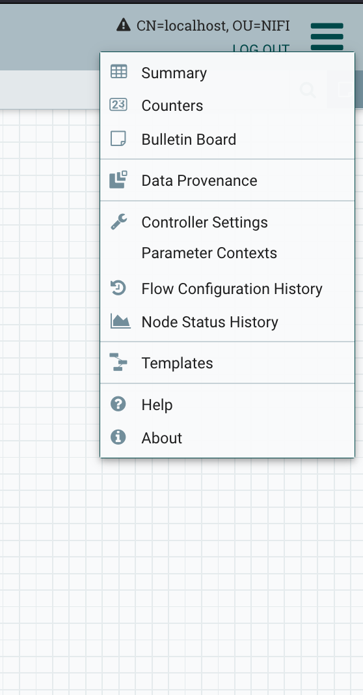
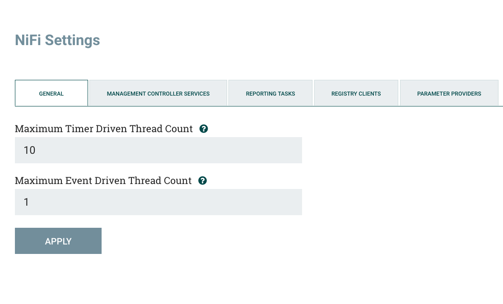
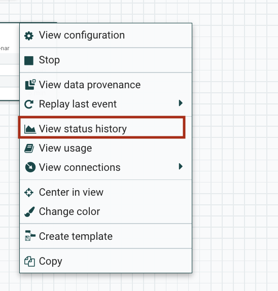
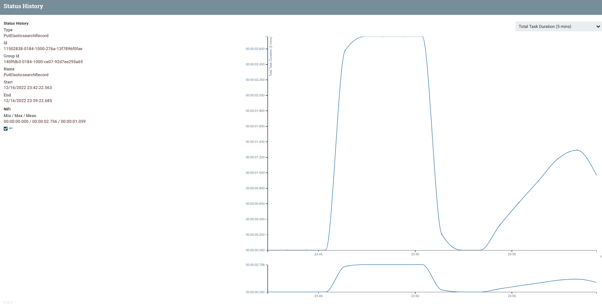
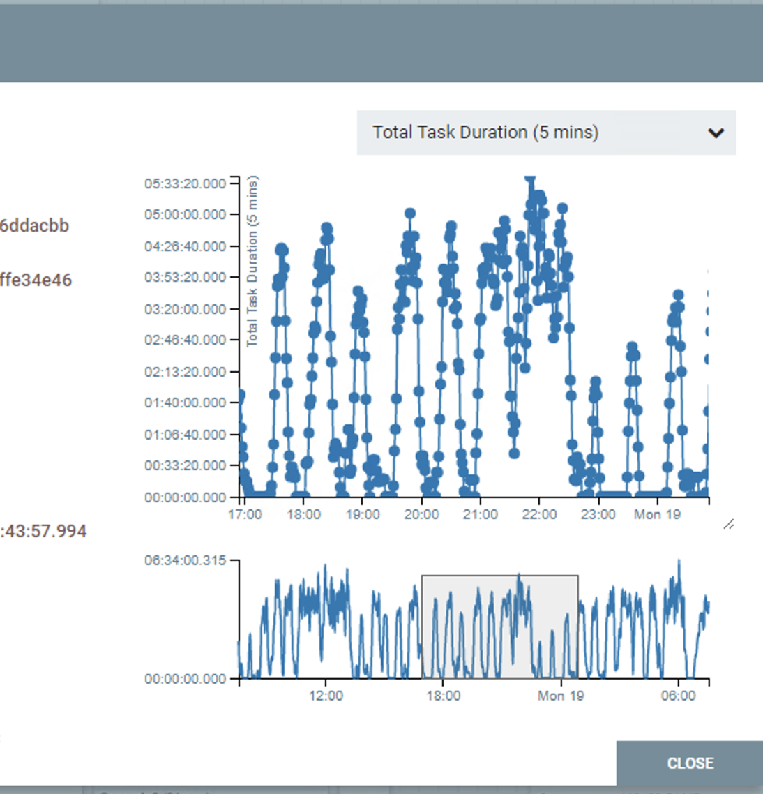

# 💧 NiFi

This directory contains files related with our custom Apache NiFi image and example deployment templates with associated services.
Apache NiFi is used as a customizable data pipeline engine for controlling and executing data flow between used services.
There are multiple workflow templates provided with custom user scripts to work with NiFi.

For more information about Apache NiFi please refer to [the official website](https://nifi.apache.org/) and the [guide](https://nifi.apache.org/docs/nifi-docs/html/administration-guide.html#how-to-install-and-start-nifi).

## Concepts you should understand in NiFi

Before going deeper into the NiFi setup and workflows, a few key concepts need to be understood:

- processor: main compontent responsible for executing tasks, this can be anything: custom scripts, DB queries, http queries, .etc
- flowfiles: these represent the common datastructure used in a NiFi session to store data between two or more entities in the workflow, a flowfile will hold one or multiple records of data.
- avro files: common data seralisation system that is used to store record data, the flowfile records that are created by most of the built-in processors are stored in this format, if you aim to use your own custom scripts with alongside the built-in processors, you will likely have to write your own code that converts your records to Avro.
- workflow: set of processors that compose the whole pipeline

Please read the following [article](https://nifi.apache.org/docs/nifi-docs/html/nifi-in-depth.html) for further clarification.

Avro Schema:[official documentation](https://avro.apache.org/docs/1.11.1/)

## `NiFi directory layout : /nifi`

    ```
    ├── Dockerfile - contains the base definition of the NiFi image along with all the packages/addons installed
    ├── conf - NiFi configuration files, this folder is mounted on the NiFi service container at runtime, it needs to have read & write permissions by the user
    ├── devel - custom folder that is mounted on the NiFi container where you may place your own scripts, again, read & write permissions required
    ├── drivers - drivers used for DB connections, currently PostgreSQL and MSSQL
    ├── nifi-app.log - log file mounted directly from the container for easy log checking
    ├── user_schemas - Avro schemas used within workflows, it can also contain other schemas used in specific custom processors
    ├── user_scripts - custom scripts used in workflows, you can put them here
    ├── user_python_extensions - Python FlowFileTransform processors exposed to NiFi's extension framework
    └── user_templates - here we store the fully exported templates of the workflows within NiFi
    ```

For user script organization and usage guidelines, see [user scripts](user_scripts.md).
For Python extension processors, see [Python extensions](user_python_extensions.md).
For end-to-end scripting patterns (including `ExecuteStreamCommand` stdin/stdout and args), see [processor scripting guide](processor_scripting.md).

```{toctree}
:maxdepth: 1

processor_scripting.md
user_scripts.md
user_python_extensions.md
```

## Custom Docker image

For any deployment it is recommended to build and use the custom Docker image of Apache NiFi that will contain all the necessary configuration, drivers, custom user scripts and workflows.

The Docker image recipe is defined in `Dockerfile` file.
There are two images being built as part of CI process:

- `cogstacksystems/cogstack-nifi:latest` - the latest image built from `master` branch,
- `cogstacksystems/cogstack-nifi:dev-latest` - the latest image built from `devel` branch.

There are also release images built for each release, for example:

- `cogstacksystems/cogstack-nifi:1.0.0` - release 1.0

## Apache NiFi configuration

The main configuration files for NiFi are provided in [`conf`](https://github.com/CogStack/CogStack-Nifi/conf) directory.

This section provides only a brief description of the most useful properties that you may need to modify to fit your own setup.
<br>

For much more detailed information please refer to the official [Apache NiFi System Administrator's Guide](https://nifi.apache.org/docs/nifi-docs/html/administration-guide.html). Another good reference for these properties is the [Cloudera Doc](https://docs.cloudera.com/HDPDocuments/HDF3/HDF-3.3.1/nifi-system-properties/hdf-nifi-system-properties.pdf) which describes everything in detail.
<br>

Below are the main configuration files that are likely in need of customisation during deployment(s):
<br>
<br>
### <strong>`{nifi.properties}`</strong>
The main file which contains the bulk of the configurable parameters for NiFi.
This file allows users to configure operational settings for NiFi on more granular level, such as the max. number of flow files to be buffered, the amount of space dedicated for data provenance, etc.

This NiFi custom image will use less resources and storage size for data provenance, flow files storage and indexing operations (mostly to avoid exceeding Java Max Heap Size errors). 
The corresponding properties have been commented out in the file.

<strong>Important properties to look for:</strong>

    ```
    nifi.flow.configuration.archive.enabled=true
    nifi.flow.configuration.archive.max.time=1 days
    nifi.flow.configuration.archive.max.storage=32 GB
    ```
The above lines are used to specify if backups of the current flow-files should be kept, keep in mind that the archive size can get quite big depending on the number of files you attempt to put through a workflow. This can easily get over 32GB so it is recommended you modify depending on the workflows and of the filesizes of the flow-files, this setting is directly affected by `nifi.queue.backpressure.count` and `nifi.queue.backpressure.size`

    ```
    nifi.queue.backpressure.count=10000
    nifi.queue.backpressure.size=1 GB
    ```

These settings specify how large can a queue's size be (any que between two processes), it is recommended to keep this as 1GB, the count is the ma number of flow-files a que can have, again 10000 is a reasonable number. <span style="color: red"> <strong>These values should be modified only if you are really certain flow-files are not being held in the queue for long as the queued flow-files are stored in RAM memory as well as on the disk. </strong>  </span> A much more safer way of doing things if you wish to change the above settings is to change the settings only for the queues you would need, this can be done during runtime, without the need to touch the `nifi.properties` file.

    ```
    nifi.bored.yield.duration=100 millis
    ```

A timer that specifies how long should NiFi waits before checking for work, CPU dependent, the lower the time the higher the CPU usage, as it would do more frequent checks. The default is 10ms but it seems too excessive for most use cases, it would also result in significant CPU usage if a large number of workflows are running in parallel, so it has been set to 100ms instead.

    ```
    nifi.flow.configuration.archive.enabled=true
    nifi.flow.configuration.archive.max.time=1 days
    nifi.flow.configuration.archive.max.storage=12 GB
    ```

By default, the flowfiles thar are out of the processing queues will be archived for a set period of time. The `nifi.flow.configuration.archive.max.time` sets the max duration, max size configurable via `nifi.flow.configuration.archive.max.storage`, take note of these properties, the storage limit can quickly be hit if you have a high flow-file throughput.

Make sure to check the archive storage and flowfile storage settings as these will be the first to impact the space used for logging.
<br><br>

#### IMPORTANT NOTE about nifi properties

:::{admonition} IMPORTANT NOTE about `nifi.properties`
:class: warning
For Linux users : This is a file that will get modified on runtime as when the container is up some of the properties within the file will get changed ( `nifi.cluster.node.address` for example). Some permission error's might pop out as the UID and GID of the folder permissions are different from that of the user within the container, which is using UID=1000 and GID=1000, declared in the `Dockerfile` and in `deploy/services.yml` under the `nifi` service section. To avoid permission issues, on the host container you will need to create a group with the GID 1000, assign the user that is running the docker command to the created group, and everything should work.
:::

<span style="color:orange"><strong>Recommendation:</strong></span> If the account/group creation is not possible, you will need to build your own docker image on NiFi, but before you do this, you need to get hold of your group id and user id  of the account you are logged in with.
To find out your GID and UID, you must do the following commands in terminal:

    ```bash
    echo "user id (UID):"$(id -u $USER)
    echo "group id (GID):"$(id -g $USER)
    ```

You'd need to export your ENV vars:

    ```bash
    export NIFI_UID=$(id -u $USER)
    export NIFI_GID=$(id -g $USER)
    ```

A better way is to also manually edit the `./deploy/nifi.env` file and change the default NIFI_UID and NIFI_GID variables there, after which you must execute the `export_env_vars.sh` script.

    ```bash
    cd ./deploy/
    source export_env_vars.sh
    cd ../
    ```

You should check if the env vars have been set after running the script:

    ```bash
    echo $NIFI_UID
    echo $NIFI_GID
    ```

If the above command prints some numbers then it means that the `export_env_vars.sh` script worked. Otherwise, if you don't see anything, or just blank lines, then you need to execute the following:

    ```bash
        set -o allexport
        source nifi.env
        set +o allexport
    ```

or, on Windows, via `git bash` terminal:

    ```bash
        set -a
        source nifi.env
        set +a
    ```

Make sure to execute the above commands in the order they are mentioned.


Delete the older docker image from the nifi repo:

    ```bash
    docker image rm cogstacksystems/cogstack-nifi:latest -f
    ```

Then execute the `recreate_nifi_docker_image.sh` script located in the `./nifi` folder.

    ```bash
    cd ./nifi
    bash recreate_nifi_docker_image.sh
    ```

Remember that the above export script and/or command are only visible in the current shell, so every time you restart your shell terminal you must `source ./deploy/export_env_vars.sh` so the variables are visible to Docker at runtime. If you're using the `deploy/Makefile` targets, it handles this for you.

### <strong>`{bootstrap.conf}`</strong>

<br>
This file allows users to configure settings for how NiFi should be started, it deals with location of configuration folder, files, JVM heap and Java System Properties.

    ```text
        java.arg.2=-Xms8g
        java.arg.3=-Xmx16g
    ```

These properties specify the maximum memory that can be allocated to the JVM `-Xmx16g` and the initial memory allocation `-Xms8g`, values of 8g and 16g are used by default, however you may need to change these to fully utilise the memory of the machines you are spinning the service on.
<br><br>

### <strong>`{logback.xml}`</strong>
<br>

As the file name indicates, it manages the loglevel of the NiFi service. By default most logging messages are set to either `INFO` or `ERROR`.

Possible log level settings: `OFF`(inside `logback.xml`) or `NONE` (inside the NiFi UI) - disabled, `WARN`, `ERROR`, `INFO`, `DEBUG`, please note that setting to `INFO/DEBUG` will significantly increase the rate at which logs are generated and may result in increased disk space. 

<span style="color:red"><strong>IMPORTANT: if there are start-up issues with NiFi you can set the `org.apache.nifi` setting below to `INFO` or `DEBUG` level to see the problem. For PRODUCTION it is recommended that all settings be left on `WARN` or `ERROR` levels as the logs are massive in size. </strong> </span>

<span style="color:orange"><strong>Recommendation:</strong></span> rather than modifiying `logback.xml` to see the logs of processors within NiFi you can always just enable or change per processor log-level as shown in the image below:


The most useful log sections are:

    ```
        <logger name="org.apache.nifi" level="WARN"/>
    ```

- This refers to the overall NiFi log, useful for finding out what may cause startup issues.

    ```
        <logger name="org.apache.nifi.web.security" level="WARN" additivity="false">
    ```

- Security level logging, this controls certificate or authorisation issues here.

    ```
        <logger name="org.apache.nifi.bootstrap" level="WARN" additivity="false">
    ```

- This handles issues related to the startup parameters.

    ```
        <root level="WARN">
    ```

- This is controls that is logged into the `./nifi/nifi-app.log`

### <strong>`{zookeeper.conf}`</strong>

Apache Zookeeper is a highly consistent, scalable and reliable cluster co-ordination service. 
When deploying Apache NiFi, an exernal Apache Zookeper service can be used or embedeed within NiFi service (the default option).

This custom image will use embedeed Zookeeper within NiFi service and will use the default `zookeeper.properties` file.

## NIFI security setup

In previous nifi versions by default there was no user assigned and authentication was anonymous. Since 1.14.0 this changed. So now we have HTTPS enabled by default via port 8443 (configurable in nifi.properties and the services.yml file).

Please use the [security guide](../security/main.md) section to set up accounts and certificates.

## Drivers

The drivers are provided in [`drivers`](https://github.com/CogStack/CogStack-NiFi/tree/main/nifi/drivers) directory.

The key used ones are:

- `mssql-jdbc-13.2.0.jre11.jar` - MS SQL Server JDBC driver.
- `postgresql-42.7.7.jar` - PostgreSQL JDBC driver.
- `mysql-connector-j-9.4.0.jar` - MySQL JDBC driver.
- `duckdb_jdbc-1.4.4.0.jar` - DuckDB JDBC driver.

## User resources

With our custom image there are bundled resources to get up and running example workflows.
Please see [WORKFLOWS.md](../deploy/workflows.md) in the `deploy` directory for more details on the workflows.

## Workflow templates

Workflow templates define example data workflows that can be tailored and executed by the user.
The templates are stored in [`user_templates`](https://github.com/CogStack/CogStack-NiFi/tree/main/nifi/user_templates) directory.

## User scripts

Apache NiFi gives users the ability to execute custom scripts inside the data flow (supported languages: Python, Groovy, Clojure, Ruby, Lua, ECMAScript).
[`user_scripts`](https://github.com/CogStack/CogStack-NiFi/tree/main/nifi/user_scripts) directory contains example scripts, these are mostly used when parsing the data from Flow Files.

## User schemas

[`user_schemas`](https://github.com/CogStack/CogStack-NiFi/tree/main/nifi/user_schemas) directory contains example AVRO type schemas that can be used by data parsers and processor.

## Performance settings

<strong> <span style="color: red">IIMPORTANT:</span></strong> This section covers some best practices that you can apply when dealing with NiFi workflows.  
<br>
<br>

### Setting the maximum thread count for process timers

This setting can be found by click on the top right `burger menu` as seen in the below image, once there click on `Controller Settings`.



Once there we should see a new screen, the preselected tab being `General`, we should see the `Maximum timer driven thread count` setting, this parameter controls the maximum number of threads will be used by NiFi by all processors present within workflows, this includes concurrent tasks that can be run by only 1 processor ( 1 processor can have X number of concurrent tasks, i.e if one processor executes 100 concurrent tasks then it will take 100 threads). By default it is set to just 10 threads, which clearly won't be enough for a production deployment. To change the value just type in your desired number then click the `Apply` button.

If you have proceessors that are based on events then feel free to change the value of that paremeter. It should be mentioned that most of the processors used in the sample workflows are timer driven.

<span style="color:orange"><strong>Recommendation:</strong></span> set the value of this parameter to be anywhere from from 2-4 times the CPU count you have on the machine.



### Process scheduling and task management

Users should be aware that although NiFi is quite efficient in terms of resource usage, it still needs manual configuration at a process-level to maintain a high flow-file throughput. To do this, each process ca be manually configured to ensure maximum efficiency. 

To access the scheduling menu, right click on any processor > click configure > select the `Scheduling` tab. The image below shows the fields we are interested in: `Run Schedule` and `Concurrent Tasks`.


<strong> <span style="color: red">IMPORTANT:</span></strong> In general, if a process is left on the default `0 sec` run schedule, it will attempt to start to work as soon as flowfiles are in the queue, this can be a problem as, some workflows contain large amounts of flowfiles that may also contain a huge number of records, it can strain the system at times by constantly performing I/O operations (remember that flowfiles are stored both in memory and on disk), it is best to delay the running of tasks by setting the `Run Schedule` to anything but the default, this is especially useful for DB query processors (ExecuteSQLRecord or QueryDatabaseTable), in which the schedule should be set to an interval of minutes as queries may be very slow in executing. This setting will have a direct impact on CPU and memory usage.

`Concurrent tasks` are a good way to keep things running in parallel if you feel that data is not being processed fast enough, just be aware that as stated above, one task represents one thread, and as mentioned in the `maximum thread count` section, it should not exceed the max number.
It should also be noted that a `processor` cannot have more `tasks` in current execution than the declared number `concurrent tasks`, if a task finishes its work you will notice that another will immidiately take it's place, of course, a new task may not be started if the current task has finished work and the timer is set on `run schedule` to be different than 0.

### Benchmarking

As you create workflows and put them into production, you may wish to monitor the performance of certain proceses, this is especially useful when you notice a slowdown in your flow because of a specific component (i.e, a DB query or a HTTP request that is taking too long to complete). You can view a process's operational history by right clicking it and selecting `View status history`, as shown in the image below.



You can then select the type of history you wish to check by clicking the drop-down menu on the top right, in our case we select the `Total Task Duration (5 mins)` option. Two graphs that resemble the image below should appear.

 The smaller graph can be used to select a specific time frame to view by clicking and dragging the small grey window over, this window can also be moved after the select action is released.


## Accessing NiFi via nifi-api 

Certain methods can be executed via scripts, either python or shell. Python has the `nifi-api` package for this. Check this [article](https://nifi.apache.org/docs/nifi-docs/rest-api/index.html) for more details on the methods available.

## Various data  type issues

This section covers dealing with data type issues depending on DB types and/or other data structures to Apache AVRO format.

### MySQL

Issues have been found with MySQL:

- allows zero dates in DateTime fields  -> solution: can be overcome in the URL connection string using parameters
